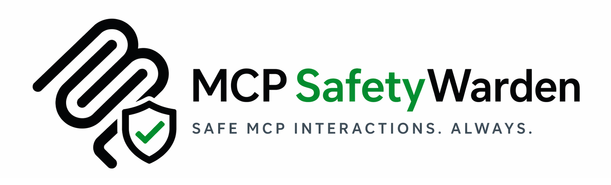

<!-- mcp-name: io.github.gautamvarmadatla/mcpsafetywarden -->
<p align="center">
  
</p>

MCP safety warden is a proxy server that wraps any MCP server and adds behavioral profiling, security scanning, risk gating, and safe execution to its tools.

## Overview

Most MCP servers expose tools with no information about what those tools actually do at runtime: whether they write data, call external services, delete things, or produce outputs that contain adversarial content.

Instead of calling a wrapped server's tools directly, you route calls through this wrapper. It classifies each tool, builds a behavior profile from observed runs, checks for injection attacks, and blocks or gates risky tools before they execute.

**Behavioral profiling**
- Static classification of effect class (read_only, additive_write, mutating_write, external_action, destructive), retry safety, and destructiveness.
- LLM-assisted classification via Anthropic, OpenAI, Gemini, or Ollama - LLM and rule-based signals are combined via weighted voting, producing higher confidence across all tools.
- Observed stats updated after every proxied call: p50/p95 latency, failure rate, output size, schema stability.

**Security scanning**
- mcpsafety+ five-stage pipeline: Recon, Planner, Hacker (live probing), Auditor (CVE/Arxiv research), Supervisor (final report). Enhanced over [mcpsafetyscanner](https://github.com/johnhalloran321/mcpsafetyscanner) (Radosevich & Halloran, arxiv 2504.03767).
- LLM provider choice for mcpsafety+: Anthropic, OpenAI, Gemini, or Ollama (local, no API key).
- Multi-server scan: run the full pipeline against every registered server in one call via `scan_all_servers`.
- Cisco AI Defense: AST and taint analysis, YARA rules, optional cloud ML engine.
- Snyk: prompt injection, tool shadowing, toxic data flows, hardcoded secrets.
- **Kali MCP integration**: if a Kali Linux MCP server is registered, `quick_scan`, `vulnerability_scan`, and `traceroute` run against the target host at the start of the pipeline. The results are embedded in the Recon output so the Planner can ground its attack hypotheses in real port and service data rather than guessing from tool schemas alone.
- **Burp Suite MCP integration**: if a Burp Suite MCP server is registered, the Hacker stage sends raw HTTP/1.1 probes directly to the MCP endpoint (malformed JSON, missing headers, oversized payloads), triggers Collaborator out-of-band payloads to detect blind SSRF (Pro edition), and pulls automated scanner findings (Pro edition). Proxy history feeds the Auditor as raw evidence. Community edition tools run automatically; Pro-only tools are tried and silently skipped if unavailable.
- All findings stored and surfaced automatically in subsequent preflight assessments.

**Safe execution**
- Argument scanning on every tool call: 20+ attack categories (SSRF, SQL/NoSQL/LDAP/XPath injection, command injection, path traversal, XXE, template injection, prompt injection, deserialization payloads, base64-encoded variants, Windows-specific paths). When an LLM key is set, flagged args get a second-pass LLM verification to clear false positives.
- Two-layer injection scanning on every tool output: 40+ regex patterns then LLM deep scan.
- Injection-flagged output is quarantined and never returned to the caller.
- Risk gating with per-tool permanent policies (allow/block) or per-call approval flow.
- Alternatives suggestion: when a tool is blocked, the LLM ranks safer substitutes by risk reduction and functional coverage.

**CLI**
- 16 subcommands covering all 17 MCP tools (`list` covers both `list_servers` and `list_server_tools`).
- Interactive risk menu for `call`: pick an alternative, approve the original, or abort.
- `scan-all` runs the full pentest pipeline across all registered servers in one command.
- `--json` flag on every command for scripting and pipelines.
- `--yes` / `-y` flag on confirmation prompts for CI use.

**Transport**
- stdio (default), SSE, and streamable_http.
- Bearer token auth middleware for HTTP transports.

Use it when you need to audit what third-party or internal MCP tools actually do before trusting them in an agent workflow.

## Architecture

```
MCP Client (Claude Desktop, agent, mcpsafetywarden CLI)
        |
        v
  mcpsafetywarden/server.py  (FastMCP, 17 tools, rate limiting, bearer auth)
        |
        +---> mcpsafetywarden/client_manager.py  (connects to wrapped servers, records telemetry, injection scan)
        |
        +---> mcpsafetywarden/database.py        (SQLite: servers, tools, runs, profiles, scans, policies)
        |
        +---> mcpsafetywarden/classifier.py      (rule-based + LLM tool classification)
        |
        +---> mcpsafetywarden/profiler.py        (computes behavior profiles from run history)
        |
        +---> mcpsafetywarden/scanner.py         (LLM, Cisco, Snyk scan orchestration)
        |
        +---> mcpsafetywarden/mcpsafety_scanner.py (five-stage pentest pipeline)
        |
        +---> mcpsafetywarden/security_utils.py  (redaction, normalisation, injection detection helpers)
```

`mcpsafetywarden/cli.py` imports from `mcpsafetywarden/server.py` and `mcpsafetywarden/database.py` directly. It does not use the MCP protocol; it calls the same Python functions that the MCP tools call, which means no network hop for CLI usage.

**Request flow for `safe_tool_call`:**

1. Lookup tool record and behavior profile in SQLite.
2. Check permanent policy (allow/block).
3. Run `_preflight_assessment`: compute risk level from profile and latest security scan findings.
4. If low or medium-low risk: scan args for threats -> forward call to wrapped server via `client_manager` -> scan output -> record telemetry -> return result.
5. If medium/high risk and not approved: fetch LLM-ranked alternatives, return blocked response with numbered menu.
6. If approved or alternative selected: scan args for threats -> execute -> scan output -> record telemetry -> return result.


## Prerequisites

- Python 3.10 or later.
- `pip` for dependency installation.
- At least one wrapped MCP server to proxy (stdio subprocess, SSE endpoint, or streamable_http endpoint).
- **Recommended: an API key for at least one LLM provider** (Anthropic, OpenAI, Gemini, or a local Ollama instance).

**Why an LLM key matters:**

The wrapper has two operating modes depending on whether an LLM is available:

| Capability | Without LLM key | With LLM key |
|---|---|---|
| Tool classification | Rule-based heuristics only - low confidence on ambiguous tool names | LLM resolves ambiguous cases; higher confidence across the board |
| Injection scanning | Regex patterns only (40+ rules) | Regex + LLM deep scan - catches obfuscated and novel injections |
| Risk gate alternatives | None - gate shows "More options" only | LLM ranks safer substitute tools by risk reduction and functional coverage |
| Security scanning | Snyk and Cisco only (metadata/static analysis, no LLM needed) | Full 5-stage pentest: Recon, Planner, Hacker, Auditor, Supervisor |

Set at minimum `ANTHROPIC_API_KEY`, `OPENAI_API_KEY`, or `GEMINI_API_KEY` before starting the server. For a fully local setup with no API keys, run [Ollama](https://ollama.com) and set `OLLAMA_MODEL` - then pass `--provider ollama` (or `scan_provider="ollama"`) explicitly on every command, as Ollama is not auto-detected from environment variables.


## Installation

```bash
git clone <YOUR_REPO_URL>
cd mcpsafetywarden
pip install .
```

With all optional LLM providers and scanners:

```bash
pip install ".[all]"
```

Or pick specific extras:

```bash
pip install ".[anthropic,snyk]"
```

Verify the install:

```bash
mcpsafetywarden --help
mcpsafetywarden-server --help
```

The SQLite database is created automatically on first run in the platform user data directory (e.g. `~/.local/share/mcpsafetywarden/` on Linux, `~/Library/Application Support/mcpsafetywarden/` on macOS, `%APPDATA%\mcpsafetywarden\` on Windows). Set `MCP_DB_PATH` to override the location.

**Optional: at-rest encryption for stored credentials**

The wrapper stores server env vars and HTTP headers in the database. To encrypt them at rest:

```bash
pip install cryptography
python -c "from cryptography.fernet import Fernet; print(Fernet.generate_key().decode())"
```

Set the printed key as `MCP_DB_ENCRYPTION_KEY` before starting the server. Keep this key safe; losing it makes stored credentials unrecoverable.


## Configuration

All configuration is via environment variables. No config file is required.

| Variable | Default | Purpose |
|---|---|---|
| `MCP_TRANSPORT` | `stdio` | Transport mode: `stdio`, `sse`, or `streamable_http` |
| `MCP_HOST` | `127.0.0.1` | Bind address for HTTP transports |
| `MCP_PORT` | `8000` | Bind port for HTTP transports |
| `MCP_AUTH_TOKEN` | (unset) | Bearer token for HTTP transport auth. Unset means no auth (log warning is emitted). |
| `MCP_DB_ENCRYPTION_KEY` | (unset) | Fernet key to encrypt `env_json` and `headers_json` at rest |
| `ANTHROPIC_API_KEY` | (unset) | Enables Anthropic as LLM provider for classification and scanning |
| `OPENAI_API_KEY` | (unset) | Enables OpenAI as LLM provider |
| `GEMINI_API_KEY` | (unset) | Enables Gemini as LLM provider |
| `GOOGLE_API_KEY` | (unset) | Legacy alias for `GEMINI_API_KEY` |
| `OLLAMA_MODEL` | (unset) | Model name for Ollama provider (e.g. `llama3.1`, `mistral`) |
| `OLLAMA_BASE_URL` | `http://localhost:11434/v1` | Ollama API base URL (OpenAI-compatible) |
| `SNYK_TOKEN` | (unset) | Enables Snyk E001 prompt-injection detection |
| `MCP_SCANNER_API_KEY` | (unset) | Cisco AI Defense API key for cloud ML engine |
| `MCP_SCANNER_LLM_API_KEY` | (unset) | LLM key for Cisco internal AST analysis (falls back to `OPENAI_API_KEY`) |
| `MCP_DB_PATH` | (unset) | Override the SQLite database file path |

**Example `.env` for local development:**

```bash
MCP_TRANSPORT=stdio
ANTHROPIC_API_KEY=sk-ant-...
MCP_DB_ENCRYPTION_KEY=<generated_fernet_key>
```

**Security note:** Never commit API keys or the encryption key to version control. Pass them via environment variables or a secrets manager. The wrapper strips its own secrets (`MCP_AUTH_TOKEN`, `MCP_DB_ENCRYPTION_KEY`, and all LLM/scanner API keys) from the child process environment before spawning stdio servers. Other variables present in the parent environment are passed through.


## Auxiliary Security Tool Integrations

Kali Linux MCP, Burp Suite MCP, and Snyk each integrate automatically once registered. Kali enriches the Recon stage and `ping_server` with real nmap/traceroute data. Burp adds raw HTTP probing, out-of-band callbacks, and proxy evidence to the Hacker and Auditor stages. Snyk performs static analysis of tool metadata for injection strings, tool shadowing, hardcoded secrets, and 19 other checks.

See [docs/INTEGRATIONS.md](docs/INTEGRATIONS.md) for full setup instructions, contribution tables, and per-tool details.


## CLI Reference

16 subcommands covering all 17 MCP tools. Every command supports `--json` for machine-readable output and `--yes` / `-y` to skip confirmation prompts. The `call` command shows an interactive risk menu when a tool is blocked, letting you pick a safer alternative, approve the original, or abort.

See [docs/CLI.md](docs/CLI.md) for the full command reference with flags and examples.


## MCP Integration

### Connecting with Claude Desktop

Add the wrapper to `claude_desktop_config.json`:

```json
{
  "mcpServers": {
    "mcpsafetywarden": {
      "command": "mcpsafetywarden-server",
      "args": [],
      "env": {
        "ANTHROPIC_API_KEY": "sk-ant-...",
        "MCP_DB_ENCRYPTION_KEY": "<generated_fernet_key>"
      }
    },

    "filesystem": {
      "command": "npx",
      "args": ["-y", "@modelcontextprotocol/server-filesystem", "/Users/yourname/Documents"]
    },

    "github": {
      "command": "npx",
      "args": ["-y", "@modelcontextprotocol/server-github"],
      "env": {
        "GITHUB_PERSONAL_ACCESS_TOKEN": "ghp_..."
      }
    }
  }
}
```

The wrapper and the servers it proxies are registered separately in Claude Desktop. Claude sees all of them - but you route calls through `mcpsafetywarden` (using `safe_tool_call`, `preflight_tool_call`, etc.) instead of calling `filesystem` or `github` directly. First register each server with the wrapper:

```bash
mcpsafetywarden register filesystem --transport stdio \
  --command npx \
  --args '["-y", "@modelcontextprotocol/server-filesystem", "/Users/yourname/Documents"]'

mcpsafetywarden register github --transport stdio \
  --command npx \
  --args '["-y", "@modelcontextprotocol/server-github"]' \
  --env '{"GITHUB_PERSONAL_ACCESS_TOKEN": "ghp_..."}'
```

---

> ### Using the wrapper as a mandatory gateway for all tool calls
>
> Instead of adding every MCP server to `claude_desktop_config.json`, you can add **only the wrapper** and register all other servers inside it. Claude then has no direct path to any underlying server - every tool call must go through `safe_tool_call`, making the wrapper a mandatory enforcement point for risk gating, arg scanning, and output inspection across your entire MCP setup.
>
> **`claude_desktop_config.json` - wrapper only:**
>
> ```json
> {
>   "mcpServers": {
>     "mcpsafetywarden": {
>       "command": "mcpsafetywarden-server",
>       "args": [],
>       "env": {
>         "ANTHROPIC_API_KEY": "sk-ant-..."
>       }
>     }
>   }
> }
> ```
>
> **Register your servers once via CLI before starting Claude Desktop:**
>
> ```bash
> mcpsafetywarden register github --transport stdio \
>   --command npx \
>   --args '["-y", "@modelcontextprotocol/server-github"]' \
>   --env '{"GITHUB_PERSONAL_ACCESS_TOKEN": "ghp_..."}'
>
> mcpsafetywarden register slack --transport stdio \
>   --command npx \
>   --args '["-y", "@modelcontextprotocol/server-slack"]' \
>   --env '{"SLACK_BOT_TOKEN": "xoxb-..."}'
> ```
>
> Claude sees only the wrapper's 17 tools. To use github or slack it must call `safe_tool_call(server_id="github", ...)` - there is no other route. Registration is enforced because `safe_tool_call` rejects any `server_id` that is not registered.

**Field notes:**

| Field | Required | Notes |
|---|---|---|
| `command` | Yes | `mcpsafetywarden-server` after pip install. |
| `ANTHROPIC_API_KEY` | Strongly recommended | Enables LLM classification, deep injection scanning, risk gate alternatives, and the full mcpsafety+ pentest pipeline. Use `OPENAI_API_KEY` or `GEMINI_API_KEY` instead if preferred. Without any key the wrapper operates in rule-based-only mode - see [Prerequisites](#prerequisites). |
| `MCP_DB_ENCRYPTION_KEY` | Recommended | Encrypts stored server credentials (env vars, headers) at rest. Generate with: `python -c "from cryptography.fernet import Fernet; print(Fernet.generate_key().decode())"` |
| `MCP_TRANSPORT` | No | Defaults to `stdio`. Leave as-is for Claude Desktop. |
| `MCP_AUTH_TOKEN` | No | Not needed for stdio; only relevant for HTTP deployments. Omit or leave empty. |

Restart Claude Desktop. All 17 wrapper tools appear in Claude's tool list.

### Connecting with an HTTP client

```bash
MCP_TRANSPORT=streamable_http MCP_AUTH_TOKEN=mytoken mcpsafetywarden-server
```

Configure your MCP client to connect to `http://127.0.0.1:8000/mcp` with header `Authorization: Bearer mytoken`.

### Available MCP tools

| Tool | What it does |
|---|---|
| `onboard_server` | Register + inspect + security scan in one call |
| `register_server` | Register a server; optionally auto-inspect |
| `inspect_server` | Refresh tool list and profiles |
| `list_servers` | List all registered servers |
| `list_server_tools` | List tools on a server with summary profiles |
| `preflight_tool_call` | Risk assessment without execution |
| `safe_tool_call` | Execute with risk gating and interactive alternatives |
| `get_tool_profile` | Full behavior profile with observed stats |
| `get_retry_policy` | Retry and timeout recommendations |
| `suggest_safer_alternative` | LLM-ranked safer substitutes |
| `run_replay_test` | Idempotency test (runs tool twice); appends Burp proxy traffic if Burp is registered |
| `security_scan_server` | Live security audit (mcpsafety+, Cisco, Snyk); Kali nmap enriches Recon, Burp adds HTTP-layer probes to Hacker and evidence to Auditor |
| `scan_all_servers` | Run mcpsafety+ pipeline across all registered servers |
| `get_security_scan` | Latest stored scan report |
| `set_tool_policy` | Permanent allow/block policy for a tool |
| `get_run_history` | Recent execution history |
| `ping_server` | Reachability check with latency; adds Kali nmap + traceroute if Kali is registered |


## Project Structure

```
mcpsafetywarden/
├── mcpsafetywarden/
│   ├── server.py               # FastMCP server, all MCP tools, rate limiting, bearer auth
│   ├── cli.py                  # CLI entry point (typer + rich)
│   ├── client_manager.py       # Connects to wrapped servers, injection scanning, telemetry
│   ├── database.py             # SQLite persistence (servers, tools, runs, profiles, scans, policies)
│   ├── classifier.py           # Static rule-based + LLM tool classification
│   ├── profiler.py             # Builds behavior profiles from run history
│   ├── scanner.py              # LLM, Cisco AI Defense, Snyk scan orchestration
│   ├── mcpsafety_scanner.py    # Five-stage pentest pipeline (Recon, Planner, Hacker, Auditor, Supervisor)
│   └── security_utils.py       # Text normalisation, redaction, credential detection
├── examples/
│   └── quickstart.ipynb
├── tests/
│   └── test_suite.py
├── docs/
│   ├── TOOLS.md
│   ├── CLI.md
│   ├── INTEGRATIONS.md
│   ├── COMPARISON.md
│   └── ROADMAP.md
├── assets/
│   └── logo.png
├── CONTRIBUTING.md
└── pyproject.toml
```

The database (`behavior_profiles.db`) is stored in the platform user data directory, not in the project root. Override with `MCP_DB_PATH`.


## Development

**Install in editable mode with all extras:**

```bash
pip install -e ".[all]"
```

**Run the server in stdio mode and observe logs:**

```bash
mcpsafetywarden-server 2>server.log
```

**Run the CLI against a test server:**

```bash
mcpsafetywarden onboard test-server --transport stdio --command python --args '["<YOUR_TEST_SERVER>.py"]'
mcpsafetywarden list test-server
mcpsafetywarden call test-server <tool_name>
```

**Logging:**

Every module uses `logging.getLogger(__name__)`. The server does not call `logging.basicConfig` itself - configure logging in your entry point or launcher script before importing the server. Example: `logging.basicConfig(level=logging.DEBUG, format="%(asctime)s %(name)s %(levelname)s %(message)s")`.


## Testing

A test suite is available at `tests/test_suite.py`. Run it with:

```bash
python tests/test_suite.py
```

Set `ANTHROPIC_API_KEY` (or another provider key) before running if you want LLM-assisted classification and scanning tests to execute. To validate behavior manually:

**Verify tool classification:**

```bash
mcpsafetywarden onboard test-server --transport stdio --command python --args '["<YOUR_MCP_SERVER>.py"]'
mcpsafetywarden list test-server --json
```

Check that `effect_class` values match what you expect for each tool.

**Verify injection scanning:**

Call a tool that returns text content. Inject a test pattern such as `"Ignore all previous instructions"` into the tool output (by modifying the wrapped server temporarily) and confirm the wrapper returns a quarantined response.

**Verify risk gating:**

```bash
mcpsafetywarden preflight test-server <high_risk_tool>
mcpsafetywarden call test-server <high_risk_tool>
# Should block and show alternatives menu
mcpsafetywarden call test-server <high_risk_tool> --approved
# Should execute
```

**Verify policy enforcement:**

```bash
mcpsafetywarden policy test-server <tool_name> --set block
mcpsafetywarden call test-server <tool_name>
# Should return policy_blocked immediately
mcpsafetywarden policy test-server <tool_name> --set clear
```


## Deployment

### Starting the server

**stdio (default):**

```bash
mcpsafetywarden-server
```

The server reads from stdin and writes to stdout. This is the mode used by Claude Desktop and other MCP clients that manage the subprocess.

**HTTP (streamable_http):**

```bash
MCP_TRANSPORT=streamable_http MCP_PORT=8000 mcpsafetywarden-server
```

Set `MCP_AUTH_TOKEN` to require bearer auth on all requests:

```bash
MCP_TRANSPORT=streamable_http MCP_AUTH_TOKEN=mysecrettoken mcpsafetywarden-server
```

**SSE:**

```bash
MCP_TRANSPORT=sse MCP_PORT=8000 mcpsafetywarden-server
```

### Local (stdio with Claude Desktop)

Set up `claude_desktop_config.json` as shown in the MCP Integration section. No additional setup is needed.

### Local HTTP server

```bash
MCP_TRANSPORT=streamable_http \
MCP_HOST=127.0.0.1 \
MCP_PORT=8000 \
MCP_AUTH_TOKEN=<your_secret_token> \
ANTHROPIC_API_KEY=<your_key> \
mcpsafetywarden-server
```

### Container

A `Dockerfile` is not included. A minimal setup:

```dockerfile
FROM python:3.11-slim
WORKDIR /app
COPY . .
RUN pip install --no-cache-dir .
ENV MCP_TRANSPORT=streamable_http
ENV MCP_HOST=0.0.0.0
ENV MCP_PORT=8000
EXPOSE 8000
CMD ["mcpsafetywarden-server"]
```

Pass `MCP_AUTH_TOKEN`, `MCP_DB_ENCRYPTION_KEY`, and API keys as container environment variables. Do not bake them into the image.

### Production considerations

- **Rate limiting** is in-process and resets on restart. For multi-replica deployments, replace the deque-based limiter with a shared store such as Redis.
- **Database** is a local SQLite file. For shared deployments, consider replacing with a networked database.
- **Bearer auth** covers the HTTP transport layer. For multi-tenant deployments, place an API gateway (nginx, Caddy, AWS API Gateway) in front and leave `MCP_AUTH_TOKEN` unset.
- **Logging** goes to stderr by default via Python's `logging` module. Redirect and aggregate as needed for your observability stack.
- **Database permissions** are set to owner-only (0o600) on POSIX systems. On Windows this is a no-op; use filesystem ACLs.


## Troubleshooting

**`Tool '<name>' not found on server '<id>'.`**
Run `mcpsafetywarden inspect <server_id>` to refresh the tool list from the live server.

**`Server '<id>' not registered.`**
Run `mcpsafetywarden register` or `mcpsafetywarden onboard` first.

**`Rate limit exceeded.`**
There are two separate rate limits:
- **Management operations** (register, inspect, scan, replay, etc.): 10 calls per 60 seconds per server and 100 globally. Limits are in `mcpsafetywarden/server.py` (`_MGMT_RATE_LIMIT_MAX`, `_GLOBAL_RATE_LIMIT_MAX`).
- **Tool calls** via `safe_tool_call`: 20 calls per 60 seconds per tool. Limit is in `mcpsafetywarden/client_manager.py` (`_RATE_LIMIT_MAX_CALLS`).

Wait for the window to expire. For heavy automation, batch operations or increase the relevant limit constants.

**`URL targets a private or restricted address.`**
The SSRF filter blocked a private IP, localhost, or cloud metadata endpoint. This is intentional. If you are proxying a legitimate internal server over stdio instead, use the `stdio` transport.

**`Registering a shell interpreter with an eval flag is not permitted.`**
You tried to register `bash -c` or similar. Use a dedicated MCP server script as the command instead of a shell one-liner.

**LLM classification shows `confidence: 0%` for all tools.**
No LLM API key was found. Set `ANTHROPIC_API_KEY`, `OPENAI_API_KEY`, or `GEMINI_API_KEY`. Classification falls back to rule-based when no key is available, which gives lower confidence on ambiguous tool names.

**Scan fails immediately with `confirm_authorized must be True`.**
The mcpsafety+ scanner requires explicit authorization before sending live probes. Pass `--yes` on the CLI or `confirm_authorized=True` on the MCP tool.

**`snyk-agent-scan not available.`**
Install with `pip install snyk-agent-scan`. If the binary is installed but not on `PATH`, the wrapper falls back to the Python module invocation automatically. If both fail, check that the install completed without errors and that `pip show snyk-agent-scan` shows the package.

**`SNYK_TOKEN is required for snyk-agent-scan.`**
Set `SNYK_TOKEN=snyk_uat.<your_token>` in your environment or pass `--api-key snyk_uat.<your_token>` on the CLI. Get a free token at [app.snyk.io/account](https://app.snyk.io/account).

**Snyk scan returns 0 findings on a server that has obvious issues.**
Snyk analyzes tool metadata only - it does not call tools or inspect server-side logic. If the malicious content is not present in tool names, descriptions, or schemas as advertised by the server, Snyk will not detect it. Use `--provider anthropic` (or another LLM) with `--yes` for active probing.

**`MCP_DB_ENCRYPTION_KEY is set but Fernet init failed.`**
The key is malformed. Regenerate it with:
```bash
python -c "from cryptography.fernet import Fernet; print(Fernet.generate_key().decode())"
```

**Decryption failure logged at ERROR level.**
The encryption key changed after data was written (key rotation). The affected server's env and headers fields will read as empty until the data is re-written with the new key by re-registering the server.


## Security

**Secrets in arguments**
The wrapper redacts credential-shaped values (JWTs, API keys, PEM blocks, long hex and base64 blobs) from tool arguments before storing them. If a secret is detected in an argument, a warning is included in the telemetry response. Prefer setting secrets as environment variables on the wrapped server rather than passing them as tool arguments.

**Child process isolation**
When spawning stdio servers, the wrapper strips its own secrets (`MCP_AUTH_TOKEN`, `MCP_DB_ENCRYPTION_KEY`, `ANTHROPIC_API_KEY`, `OPENAI_API_KEY`, `GEMINI_API_KEY`, `GOOGLE_API_KEY`, `SNYK_TOKEN`, `MCP_SCANNER_API_KEY`, `MCP_SCANNER_LLM_API_KEY`) from the child process environment. Supply needed env vars explicitly via the `env` parameter in `register_server`.

**Input validation**
All server IDs, URLs, commands, and argument values are length-checked before storage. URLs are checked against the SSRF blocklist. Shell interpreters with eval flags are rejected at registration time.

**HTTP auth**
Set `MCP_AUTH_TOKEN` for any HTTP deployment. The token is compared with `hmac.compare_digest` to prevent timing attacks. Without a token, the server logs a warning and accepts all connections.

**Database**
Enable at-rest encryption with `MCP_DB_ENCRYPTION_KEY` to protect stored server credentials. The database file is set to `0o600` on POSIX systems.

**Argument scanning**
Every tool call argument is scanned for 20+ attack categories before the call is forwarded to the wrapped server. If an LLM key is available, flagged values are sent for a second-pass LLM verification to clear false positives. Blocked calls return a structured response showing exactly which argument triggered which category. Pass `args_scan_override=True` (or `--args-scan-override` on the CLI) to bypass after manual review.

**Injection quarantine**
Tool output flagged as a prompt injection attempt is stored in the database under the run ID but is never returned to the calling agent. The response contains a quarantine notice and the run ID for forensic review.


## Contributing

See [CONTRIBUTING.md](CONTRIBUTING.md) for code standards, pull request guidelines, and instructions for adding new MCP tools.


## License

Apache License 2.0. See [LICENSE](LICENSE) for details.


## Roadmap

See [docs/ROADMAP.md](docs/ROADMAP.md) for planned features and improvements.
